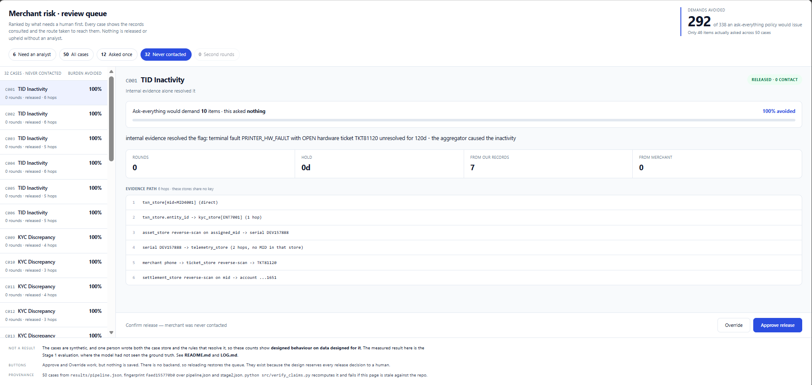
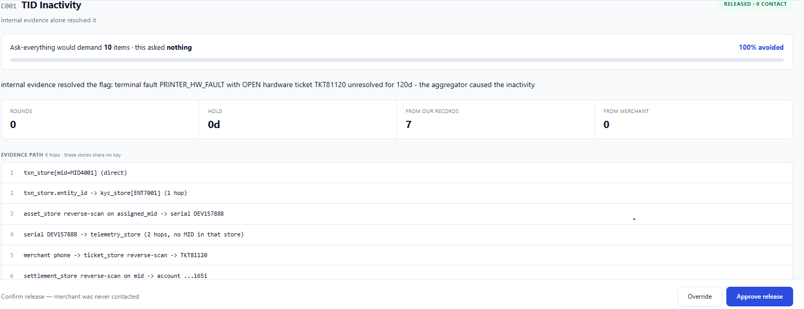
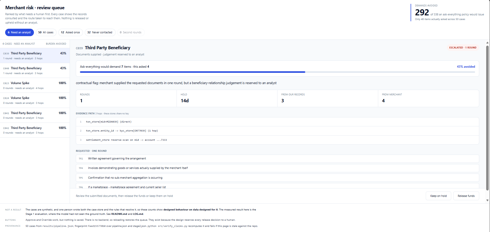

# Adjudicator

**An evidence-complete review agent for payment-aggregator risk flags.**
Razorpay Buildathon 2026 · Track 02, AI Risk Manager

[](https://github.com/Priyanshu-u07/razorpay-adjudicator/actions/workflows/verify.yml)
CI rebuilds every artefact from the seed on a clean machine. No API key exists
anywhere in this repo. It then checks every figure quoted in this README against
what the code actually produces ([verify.yml](.github/workflows/verify.yml)).

**[Open the analyst queue](https://priyanshu-u07.github.io/razorpay-adjudicator/results/queue.html)** - the live screen, 50 cases, nothing to install.

---

## The case that explains the whole project

A restaurant's card machine broke and stayed broken. A support ticket sat open in
Razorpay's own system, never closed. Four months later a separate Razorpay system
noticed the terminal had processed nothing for 94 days and deactivated it for
inactivity.

The rule that fired was **correct**: dormant terminals get resold and used to
launder payments. But a second fact sat in the same company: an open hardware
ticket saying the machine was dead. Two facts, two systems, nothing joining them.

> *"the TID has been deactivated for no transactions since more than 3 months"*
> Merchant review, May 2025 ([coded corpus](research/complaints/), R036)

**You cannot fix this with a better detector.** A more accurate dormancy model
reads the same transaction data and fires identically. The fact that refutes it
isn't in the model's inputs. It's a *joining* problem, not a modelling one.

This project builds the stage that comes after detection.

**What it measures.** A naive "ask everything" prompt reaches 98% recall and
issues **175 unconditional demands** to merchants across seven flag types. An
asymmetric one, exhaustive on internal checks and minimal on merchant asks,
issues **5**, holding 100% recall on operational flags. It drops to 63% on
contractual ones, and [that boundary](#the-boundary-where-it-fails-and-why) is
why the pipeline routes by flag class.

---

## The problem, in one paragraph

Razorpay's public API models merchant risk as a **binary flag**, `activated` or
`suspended`, with no score, no contributing signals, no appeal handle, and a
settlement hold placed with no duration is, [by their own documentation](https://razorpay.com/docs/api/payments/route/modify-settlement-hold/),
**indefinite**. Behind that flag a review process does exist, but it holds no
state: requirements arrive one at a time at 48–72 hour intervals, satisfied
requirements are re-asked weeks later, some cannot be satisfied at all, and funds
are held throughout. The harm isn't the flag. It's `N rounds × 48h` with `N`
unbounded.

Full evidence, sourcing and limitations: **[PROBLEM.md](PROBLEM.md)**
How it is built and why: **[ARCHITECTURE.md](ARCHITECTURE.md)**

---

## What it does

```
Stage 1  requirement synthesis   LLM. Derive the complete, proportionate
                                 evidence set for this flag, once, up front.
Stage 2  internal satisfaction   Entity resolution across systems that share
                                 no key. Strike off everything already held.
Stage 3  consolidated request    One round. Only what's left. Formats attached.
Stage 4  stateful verification   A satisfied requirement can never be re-asked.
                                 Impossible requirements route to a human.
```

**It is not a better detector.** Razorpay operates internal merchant risk systems
and this makes no claim to out-detect them. A correct flag and a stateless review
loop still bankrupt an honest business.

---

## The analyst screen

<a href="docs/queue.png"></a>

*Fifty cases, escalations sorted first. **[Open it live](https://priyanshu-u07.github.io/razorpay-adjudicator/results/queue.html)**, or click any screenshot for full size.*

Opening the restaurant's case:

<a href="docs/queue-detail.png"></a>

The flag was correct and the merchant was never contacted, because **six linkage
hops across six stores that share no key** found the answer already inside the
company: an open hardware ticket, unresolved for 120 days, on a terminal that had
been dead the whole time. Ask-everything would have demanded 10 items from the
merchant. This asked nothing.

Step 4 is the one to look at: `serial DEV157888 → telemetry_store (2 hops, no
MID in that store)`. There is no shared key between those systems; the path had
to be constructed.

And where the judgement is contractual rather than operational, it refuses:

<a href="docs/queue-escalated.png"></a>

The RBI-named transaction-laundering pattern. Internal records answered 3 of the
7 items and the merchant supplied the other 4 in **one round**, so the evidence
is complete. But whether a beneficiary relationship is legitimate is not a
question records can settle. It goes to a human with everything attached, and
**neither button is highlighted**, because the system holds no preference. It
can clear a flag faster or escalate it. It can never freeze anyone.

Both pages are generated by `python src/build_queue.py` into a single HTML file
with no server. The footer states what the page is and is not, so the caveats
travel with any screenshot of it.

---

## Run it

No API key, no spend, deterministic.

```bash
pip install -r requirements.txt
python src/case_store.py       # 50 synthetic cases across 8 stores
python src/stage2_resolve.py   # entity resolution + audit trail
python src/pipeline.py         # decisions on all 50
python src/test_ledger.py      # 9 adversarial tests on the ledger
python src/verify_claims.py    # recompute every number in this README
python src/build_queue.py      # render the analyst queue -> results/queue.html
```

`results/queue.html` opens in a browser with no server and no network calls. It
is the screen a risk analyst would work from: cases ranked with escalations
first, each showing the records consulted, the route taken to reach them, the
verdict in words, and a recommended action. **Nothing releases or upholds a hold
without a human**. Every case carries approve and override.

That last command is the point. It recomputes all 27 headline figures from the
files that produce them and **fails if any number in this README is unsupported**
so nothing here can go stale without the check catching it. Full
claim-to-evidence map: [results/claims.md](results/claims.md).

---

## Results

### Stage 1: measured, model had not seen the ground truth

Seven flag types, three prompt variants, hand-built ground truth frozen before
scoring. Every response scored twice: mechanically by keyword, then adjudicated
by hand with the candidate text quoted ([rulings](results/adjudication.md)).

| variant | recall | items | asks | **unconditional asks** |
|---|---|---|---|---|
| baseline (ask everything) | 98% | 348 | 175 | **175** |
| asymmetric | 89% | 175 | 32 | **5** |

**175 unconditional merchant demands → 5.**

The asymmetric prompt applies opposite rules to the two halves of the answer:
exhaustive on internal checks, which cost the merchant nothing; minimal on
merchant requests, each of which must name the hypothesis it rules out *and*
confirm no internal record could answer it.

### The boundary: where it fails, and why

| flag class | baseline recall | asymmetric recall | asymmetric unconditional asks |
|---|---|---|---|
| **operational** (5 flags) | 100% | **100%** | **3** (vs 126) |
| **contractual** (2 flags) | 93% | **63%** | 2 |

On operational flags (a dead terminal, a volume spike, a name mismatch)
internal records genuinely settle the question. On **contractual** ones they do
not: behavioural data can suggest an arrangement exists, but only a document
establishes who contracted with whom. Asymmetric under-asks there, and the worst
case is `THIRD_PARTY_BENEFICIARY` (43%), which is the RBI-named
transaction-laundering pattern, the flag where under-asking is most dangerous.

**This is a real limit, not a tuning problem.** The system routes by flag class
because the measurement said to.

### Pipeline: 50 cases end to end

```
resolved with ZERO merchant contact : 36/50  (72%)
resolved in ONE round               : 14
needed more than one round          :  0
routed to human review              :  6
escape rate                         :  0 of 4 labelled bad actors released
detected and escalated              :  4 of 4, by detection rules on the evidence
items asked of merchants            : 46  (vs 338 ask-everything)   −86%
maximum hold on any case            : 14 days, never unbounded
```

For the flagship flag, Stage 1 is **real model output**: an id-tagged
adjudication plan ([experiments/stage1/responses_idtagged/](experiments/stage1/responses_idtagged/))
whose gates, like *ask why the terminal is inactive **only if** no hardware
ticket or fault code already explains it*, are evaluated per case. The other
six flags run on the frozen-checklist simplification, stated in
[ARCHITECTURE.md, Section 3](ARCHITECTURE.md).

Escalation is decided by detection rules over the linked evidence: card-testing
signatures, a beneficiary that fails entity matching with no settlement history.
The `should_escalate` label is read only afterwards, to score those detections;
one of the adversarial tests flips the label both ways on all 50 cases and
proves the outcome never changes. *(An earlier version branched on the label
directly, which made the escape rate zero by reading the answer key. Found and
fixed, see LOG.md.)*

The R036 case resolves without contacting the merchant, in six linkage hops
across six stores with no shared key:

```
1. txn_store[mid=MID4001]                              (direct)
2. txn_store.entity_id -> kyc_store[ENT7001]           (1 hop)
3. asset_store reverse-scan on assigned_mid -> DEV157888
4. DEV157888 -> telemetry_store         (2 hops; that store has no MID)
5. merchant phone -> ticket_store reverse-scan -> TKT81120
6. settlement_store reverse-scan on mid -> account ...1651

verdict: PRINTER_HW_FAULT + OPEN hardware ticket unresolved 120d
           the aggregator caused the inactivity
```

### Ledger: guarantees proved, not asserted

`re-ask rate: 0` is an absence, not a proof. Nine adversarial tests attack the
ledger and pipeline directly; three try to re-ask a satisfied requirement and receive an
exception naming the requirement and its original source. Each maps to a
documented corpus failure. R034 (re-asked a month later), R035 (impossible GST
requirement), R036 (answer already held internally).

---

## What I measured that I did not expect

**Asking everything at once is not the fix.** The first Stage 1 run returned 100%
recall and 51 requirements for a broken card terminal, 22 of them demanded from
the merchant, including a live video verification of the proprietor. Completeness
without proportionality is a wall instead of a corridor. That failure produced
the asymmetric design.

**My first proportionality constraint made it worse in a specific direction.** It
pruned internal checks 48% and merchant asks only 32%. Backwards. One necessity
test applied to two populations with opposite cost structures. Proportionality
has to be asymmetric.

**Prohibitions get hedged, not obeyed.** Told not to request KYC refresh, licence
renewals or tax filings, the model returned all of them wrapped in *"if the one
on file has expired"*. State a positive rule, not a list of things not to do.

**Two bugs in my own instruments produced wrong numbers**, both caught by
checking the instrument rather than the result: a keyword scorer that missed on
wording in 6 of 7 flags, and a regex whose `\b` became a literal backspace
character through a shell heredoc, so it silently matched nothing.

Dated, in order, as it happened: **[LOG.md](LOG.md)**

---

## What this does not claim

- **The pipeline's numbers are not a result.** I wrote the case store and the
  resolution rules. Those counts show designed behaviour on data designed for
  it. Both tools print this warning on every run so the figures cannot be quoted
  without it. The measured result is Stage 1, where the model had not seen the
  ground truth.
- **The pipeline does not parse Stage 1's real output.** It uses the frozen
  requirement checklist instead. That removes the model's over-production and all
  wording variance, a difficulty the real system would face. Reasoning and the
  fix are in [ARCHITECTURE.md, Section 3](ARCHITECTURE.md).
- **n=1 per flag per variant.** No repeats, no variance measured.
- **Single non-blind adjudicator** who also wrote the ground truth, the prompts
  and the variants. The weakest link in the measurement. Adjudication changed
  recall figures in every round and **never once changed the ordering between
  variants**.
- **No claim to better detection**, and no claim about how often real flags are
  internally resolvable.
- Twelve further limitations, including one claim investigated and dropped:
  [PROBLEM.md, Section 8](PROBLEM.md).

---

## Repository

```
PROBLEM.md                     problem statement · 20 sources · 12 limitations
ARCHITECTURE.md                design decisions, each with what forced it
LOG.md                         engineering log, dated as it happened
data/flag_requirements.yaml    7 flags · 47 requirements · frozen ground truth
data/case_store.json           50 cases across 8 stores with no shared key
src/stage1_eval.py             evaluation harness · 3 variants · dual scoring
src/case_store.py              case generator (seeded)
src/stage2_resolve.py          entity resolution + resolution rules
src/pipeline.py                stages 1-4 end to end
src/test_ledger.py             adversarial tests on the ledger guarantees
research/complaints/           37 coded merchant reviews · protocol · changelog
results/queue.html             the analyst review queue (generated from the run)
results/claims.md              every claim, its value, and the file behind it
results/                       scores, adjudication rulings, run outputs
experiments/stage1/            the recorded Stage 1 experiment. Evidence, not
                               code. 22 prompts, 16 runs, verbatim. See its own
                               README for how to verify the comparison was fair.
```
